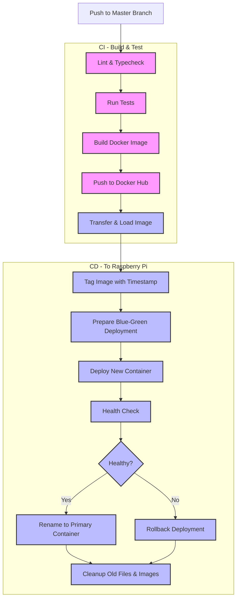
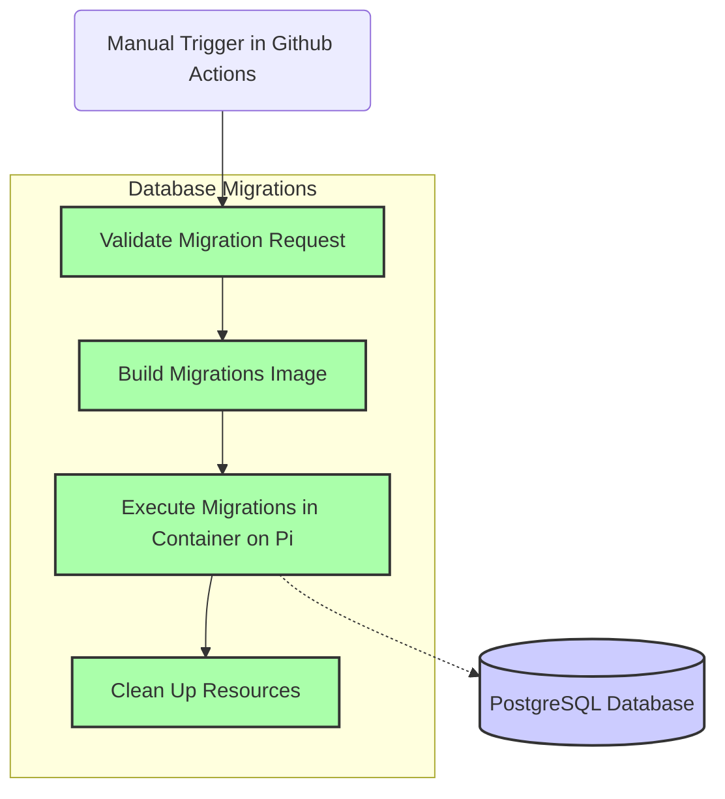
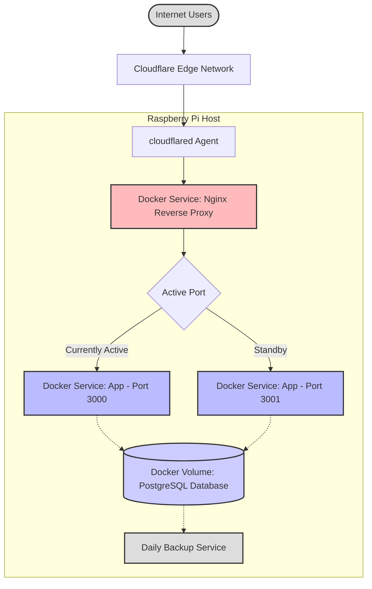

# Balanced Money

This is a personal project that I am undertaking to improve my ability as a software engineer. It is a service that i hope to use personally, to manage my personal finances.

## Inspiration

I used to work in personal financial advice and was inspired by one particular advisor who would provide an annual / semi / quarterly update to his clients in excel format - that i would prepare. This would be the basis of their meeting, additions (investments), subtractions (withdrawals, costs and fees) and the difference in the form of value and percentage change for that period of time presented in a simple table.

This was used to determine the growth / loss in a persons portfolio and compared to a predetermined well known index (aligned to the individuals attitude to risk). I would like to try and add something along those lines to this application.

This is not an application built for providing financial advice, but built to track what a person has and how it is doing, so that they are are equipped to make better financial decisions.

## Purpose

Improve a users net worth by making it easier for them to see where they are spending their money, and tracking the performance of their existing assets, so that they are are equipped to make better financial decisions.

## Getting Started

### Development

1. Clone the repository: `git clone https://github.com/JRRS1982/balanced.git`
2. Install dependencies: `npm install` on the host machine to enable local development
3. Update the environment variables in the `.env.development` file if necessary
4. Run `npm run docker:dev:build` to build the development docker images
5. Run `npm run docker:dev:up` to start the development docker containers and visit <http://localhost:3000> to view the application running in a docker container

#### Pre-commit hooks

When you commit to the repository, the `./scripts/pre-commit.sh` script will ensure you are not committing any files that are not formatted or linted and ensure that the tests pass. It will also prevent you from committing to the master or main branch. It will run;

- `npm run typecheck`
- `npm run lint`
- `npm run format`
- `npm run test`

and stage the changes to files that were formatted or linted for you to commit if they are a standard type. This should help the development flow by 'failing fast'.

### Production

Initially i deployed this app to Vercel to get it running, but i have since moved to deploying it to a Raspberry Pi, as i found it more cost effective than AWS.

The deployment process is automated via GitHub Actions, which;

- runs the tests
- runs the type checker
- runs the formatter
- runs the linter
- builds the docker image
- pushes the docker image to Docker Hub
- deploys the docker image to the Raspberry Pi via blue / green deployment to ensure minimal downtime
- runs the application
- runs the clean-up

#### GitHub Actions Secrets Required for Production Deployment / Migrations

The following secrets must be configured in your GitHub repository:

- `DOCKERHUB_USERNAME`: Your Docker Hub username
- `DOCKERHUB_TOKEN`: Your Docker Hub access token
- `SSH_PRIVATE_KEY`: SSH key to access your Raspberry Pi
- `SSH_KNOWN_HOSTS`: SSH fingerprint of your Raspberry Pi
- `PI_USERNAME`: Username for Raspberry Pi SSH login
- `PI_HOST`: IP address or hostname of your Raspberry Pi
- `DATABASE_URL`: PostgreSQL connection string
- `NEXTAUTH_SECRET`: Random string for JWT encryption
- `NEXTAUTH_URL`: Public-facing URL of your application (e.g., <https://balanced.money>)

To add these secrets:

1. Go to your GitHub repository
2. Click on "Settings" → "Secrets and variables" → "Actions"
3. Use "New repository secret" to add each item above

### Code Deployment Workflow



### Database Migrations Workflow



### Production Runtime Architecture



## Technologies Used

- **Infrastructure**:
  - Docker - Containerization solution.
  - Nginx - Reverse proxy.
  - Husky - Git hooks.
  - Prettier - Code formatter.
  - ESLint - JavaScript linter.
  - Jest - Testing framework.
  - Cypress - End-to-end testing framework.
- **Frontend**:
  - Next.js - React framework for frontend development via client components.
  - TypeScript - Typed JavaScript.
  - Recharts - Charting library.
- **Backend**:
  - Next.js - React framework for backend development via server components.
  - PostgreSQL - The database used.
  - Prisma - Database client and migration tool.
- **CI/CD**:
  - GitHub Actions - Continuous Integration and Continuous Deployment.

### Database

Postgres is used in all cases for the database in this application.

Make sure your environment variables are set correctly in the appropriate file, `.env.development`, `.env.test` or `.env.prod` see `.env.example` for more information.

#### Development Database

Both the development and testing database are hosted in separate docker containers, via the `db` service in the compose file. This allows for a consistent and platform agnostic environment for development and testing.

##### Running Development Migrations (Docker)

To build and run the containers:

```bash
npm run docker:dev:build
npm run docker:dev:up
```

Then run the migrations:

```bash
npm run docker:dev:db:migrate
```

And then rollback if necessary:

```bash
npm run docker:dev:db:rollback
```

Then stop and remove orphan containers and images after you have finished with them;

```bash
npm run docker:dev:down
```

### Contributing

Contributions are welcome! If you have suggestions for new features, improvements, or bug fixes, please open an issue or submit a pull request.

### License

This project is licensed under the MIT License.
